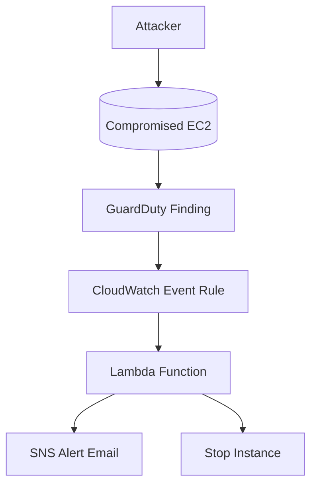

# Cloud Incident Response Automation Lab

A hands-on lab demonstrating how to automatically respond to AWS security incidents detected by GuardDuty. When a high-severity threat is detected, a Lambda function automatically isolates or stops the affected EC2 instance and sends a detailed SNS alert.

## Why This Project Matters
- Real-world relevance: Mirrors how cloud security teams automate incident response in production
- Job-ready skills: Combines GuardDuty, CloudWatch, Lambda, and SNS with Terraform IaC
- Security mindset: Builds on detection to response to automation thinking
- Demonstrates progression: Follows naturally from cloud threat detection concepts

## Architecture Overview



### Components

| Component | Purpose |
|-----------|---------|
| GuardDuty | Detects threats in real-time |
| CloudWatch Events | Triggers automation on new findings |
| Lambda Function | Executes remediation by stopping instances |
| SNS | Sends alert notifications |
| Terraform | Deploys and configures everything as code |

## Deployment

### Prerequisites

- AWS CLI configured
- Terraform >= 1.5
- Python 3.9+
- Verified email address for SNS alerts

### Steps

```bash
git clone https://github.com/yourusername/cloud-incident-response-lab.git
cd cloud-incident-response-lab/infra

# Zip Lambda and apply
cd ../lambda && zip -r ../lambda.zip .
cd ../infra
terraform init
terraform apply -auto-approve
```

### Variables

Create a terraform.tfvars file:

```hcl
aws_region     = "us-east-1"
alert_email    = "your-email@example.com"
project_name   = "cloud-incident-response"
create_test_vpc = true
create_test_instance = true
```

## Testing

### Manual Testing

1. Deploy with test instance:
   ```bash
   terraform apply -var="create_test_instance=true" -var="create_test_vpc=true"
   ```

2. Get the test instance public IP:
   ```bash
   terraform output test_instance_public_ip
   ```

3. Simulate attack from another machine:
   ```bash
   nmap -p 22 <instance_public_ip>
   ```

4. Wait 5-10 minutes for GuardDuty to detect the activity

5. Check results:
   - CloudWatch Logs for Lambda execution
   - SNS email alert
   - EC2 instance should be stopped

### Automated Testing

```bash
# Run multiple port scans to trigger GuardDuty
for i in {1..10}; do
  nmap -p 22 <instance_public_ip>
  sleep 30
done
```

## What I Learned

- How to automate cloud incident response workflows
- Integrating GuardDuty with CloudWatch and Lambda
- Writing least-privilege IAM policies for automation
- Designing end-to-end cloud security pipelines
- Terraform best practices for security automation

## Future Improvements

- Add automatic tagging of affected instances
- Send alerts to Slack or Security Hub
- Add quarantine VPC isolation instead of stopping instance
- Implement different remediation actions based on threat severity
- Add CloudTrail logging for audit trails
- Create custom GuardDuty threat lists

## Cleanup

```bash
cd infra
terraform destroy -auto-approve
```

## License

MIT License - see LICENSE file for details.