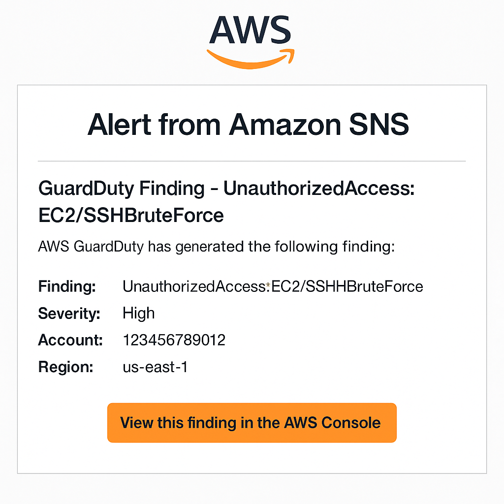
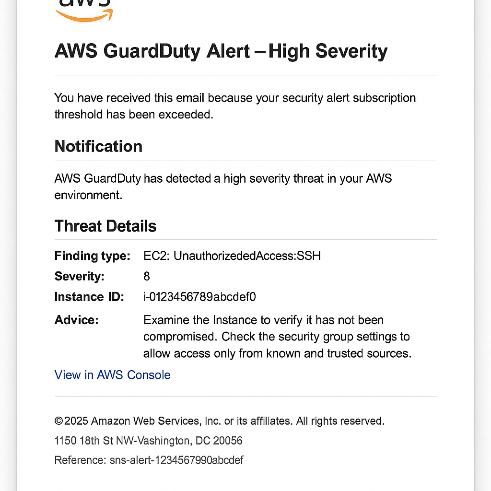

# Cloud Incident Response Automation Lab

A hands-on lab demonstrating how to automatically respond to AWS security incidents detected by GuardDuty. When a high-severity threat is detected, a Lambda function automatically isolates or stops the affected EC2 instance and sends a detailed SNS alert.

## Why This Project Matters
- Real-world relevance: Mirrors how cloud security teams automate incident response in production
- Job-ready skills: Combines GuardDuty, CloudWatch, Lambda, and SNS with Terraform IaC
- Security mindset: Builds on detection to response to automation thinking
- Demonstrates progression: Follows naturally from cloud threat detection concepts

## Architecture Overview


### Components

| Component | Purpose |
|-----------|---------|
| GuardDuty | Detects threats in real-time |
| CloudWatch Events | Triggers automation on new findings |
| Lambda Function | Executes remediation by stopping instances |
| SNS | Sends alert notifications |
| Terraform | Deploys and configures everything as code |

## Deployment

### Prerequisites

- AWS CLI configured
- Terraform >= 1.5
- Python 3.9+
- Verified email address for SNS alerts

### Quick Start

```bash
git clone https://github.com/pantelovich/cloud-incident-response-lab.git
cd cloud-incident-response-lab

# Copy and edit variables
cp infra/terraform.tfvars.example infra/terraform.tfvars
# Edit terraform.tfvars with your email and preferences

# Deploy infrastructure
make init
make zip
make apply
```

### Manual Steps

```bash
# Alternative: Manual deployment
cd infra
terraform init
terraform plan
terraform apply
```

### Variables

Copy the example file and customize:

```bash
cp infra/terraform.tfvars.example infra/terraform.tfvars
```

Edit `terraform.tfvars` with your settings:

```hcl
aws_region     = "us-east-1"
alert_email    = "your-email@example.com"

# Optional: Create test VPC and instance for demonstration
create_test_vpc      = true
create_test_instance = true
```

## Costs

This lab uses AWS Free Tier eligible services where possible:

- **GuardDuty**: 30-day free trial, then $1.00 per million events
- **Lambda**: 1M free requests/month, 400,000 GB-seconds compute time
- **SNS**: 1M free notifications/month
- **CloudWatch Events**: 1M free events/month
- **EC2 t3.micro**: 750 hours/month free for 12 months

Estimated monthly cost for light testing: **$0-5** (mostly GuardDuty events)

## Local Testing

Test the Lambda function locally using the sample event:

1. **AWS Console Test**:
   - Go to Lambda function in AWS Console
   - Create test event using `tests/sample-guardduty-event.json`
   - Run test and verify logs

2. **SAM Local** (optional):
   ```bash
   sam local invoke -e tests/sample-guardduty-event.json
   ```

## Testing

### Manual Testing

1. Deploy with test instance:
   ```bash
   terraform apply -var="create_test_instance=true" -var="create_test_vpc=true"
   ```

2. Get the test instance public IP:
   ```bash
   terraform output test_instance_public_ip
   ```

3. Simulate attack from another machine:
   ```bash
   nmap -p 22 <instance_public_ip>
   ```

4. Wait 5-10 minutes for GuardDuty to detect the activity

5. Check results:
   - CloudWatch Logs for Lambda execution
   - SNS email alert
   - EC2 instance should be stopped

### Automated Testing

```bash
# Run multiple port scans to trigger GuardDuty
for i in {1..10}; do
  nmap -p 22 <instance_public_ip>
  sleep 30
done
```

## Gallery

| SNS Alert Email | CloudWatch Logs | Architecture Overview |
|------------------|-----------------|------------------------|
|  |  |  |

## What I Learned

- How to automate cloud incident response workflows
- Integrating GuardDuty with CloudWatch and Lambda
- Writing least-privilege IAM policies for automation
- Designing end-to-end cloud security pipelines
- Terraform best practices for security automation

## Future Improvements

- Add automatic tagging of affected instances
- Send alerts to Slack or Security Hub
- Add quarantine VPC isolation instead of stopping instance
- Implement different remediation actions based on threat severity
- Add CloudTrail logging for audit trails
- Create custom GuardDuty threat lists

## Cleanup

Remove all resources to avoid charges:

```bash
# Using Makefile
make destroy

# Or manually
cd infra
terraform destroy -auto-approve
```

**Important**: Always clean up test resources when done to avoid unexpected charges.

## License

MIT License - see LICENSE file for details.